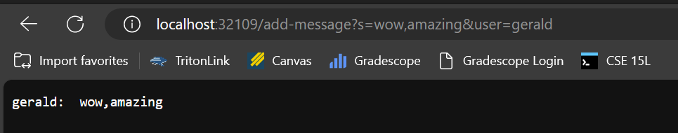
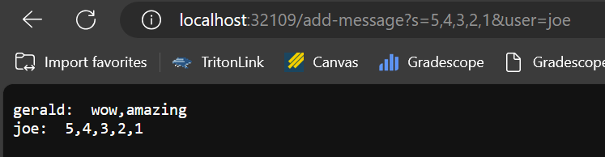

# Week 3 Lab Report - Matt Fan

## Part 1
Here is my implementation:
```java
class Handler implements URLHandler {
    String state;

    public Handler() {
        state = "";
    }

    public String handleRequest(URI url) {
        if (url.getPath().contains("/add-message")) {
            String message;
            String name;

            try {
                String[] parameters = url.getQuery().split("=");
                message = parameters[1].split("&")[0];
                name = parameters[2];
            } catch (Exception e) {
                return "Invalid request!";
            }

            state += name + ":  " + message + "\n";
            return state;
        }
        
        return "404 Not Found!";
    }
}
```
The source code for the Server class and the ChatServer class containing the main method were not modified (with the obvious exception or renaming NumberServer to ChatServer).


- **Methods called**: I'm calling my custom `handleRequest` implementation. The code makes use of library provided functions, like `getPath()` and `getQuery()` on the URI object and `split()` and `contains()` for string manipulation.
- **Arguments**: `handleRequest` takes in a URI object corresponding to the URI `http://localhost:32109/add-message?s=wow,amazing&user=gerald`. The string method `contains()` takes in the "/add-message" path I'm checking for and `split()` is called with & and = characters to properly parse the query string. I'm not passing anything to `getPath()` and `getQuery()`.
- **Fields**: The `state` string field is an empty string, as it was initialized by the constructor.
- **Field changes**: This method appends a string to `state` with the request parameters so that it contains
```
gerald: wow, amazing
```
There is a newline at the end.


- **Methods called**: I'm calling my custom `handleRequest` implementation and the same library functions.
- **Arguments**: `handleRequest` takes in a URI object corresponding to the URI `http://localhost:32109/add-message?s=5,4,3,2,1&user=joe`. The other library functions are used the same way.
- **Fields**: The `state` string field of the class initially contains the previous message, `"gerald: wow,amazing"`.
- **Field changes**: This generates a string corresponding to the request and appends it to `state`, altering it to read:
```
gerald: wow, amazing
joe: 5,4,3,2,1
```
There is a newline at the end.

## Part 2
Note that these key locations are files so `ls` just prints their paths.
Private key location on local machine:
```
matt@aaaaaaaaaa MINGW64 ~
$ ls /c/Users/etrit/.ssh/id_rsa
/c/Users/etrit/.ssh/id_rsa
```
Public key location on ieng6:
```
[chf006@ieng6-201]:~:148$ ls /home/linux/ieng6/oce/3f/chf006/.ssh/authorized_keys
/home/linux/ieng6/oce/3f/chf006/.ssh/authorized_keys
```
Passwordless login:
```
$ ssh chf006@ieng6.ucsd.edu
Last login: Wed Jan 17 11:15:01 2024 from tower-us4.prod.edstem.org
Hello chf006, you are currently logged into ieng6-201.ucsd.edu

You are using 0% CPU on this system

Cluster Status
Hostname     Time    #Users  Load  Averages
ieng6-201   16:30:01   27  0.18,  0.61,  0.53
ieng6-202   16:30:01   11  0.48,  0.61,  0.58
ieng6-203   16:30:01   17  0.10,  0.25,  0.31


To begin work for one of your courses [ cs15lwi24 ], type its name
at the command prompt.  (For example, "cs15lwi24", without the quotes).

To see all available software packages, type "prep -l" at the command prompt,
or "prep -h" for more options.
[chf006@ieng6-201]:~:132$

```

## Part 3
I had no idea that passwordless login to SSH was a thing! I can just generate a key, save it to my `.ssh` folder, and upload it accordingly to the remote host. This is going to be a real timesaver in the future.
