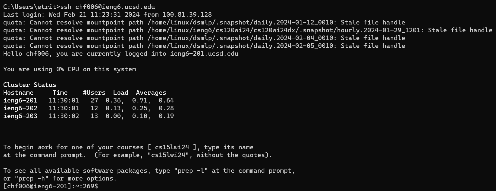
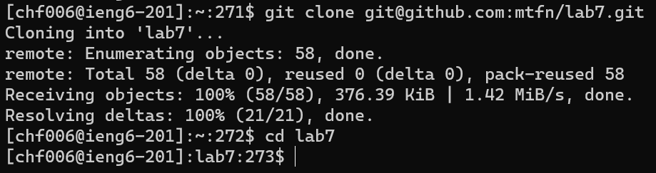
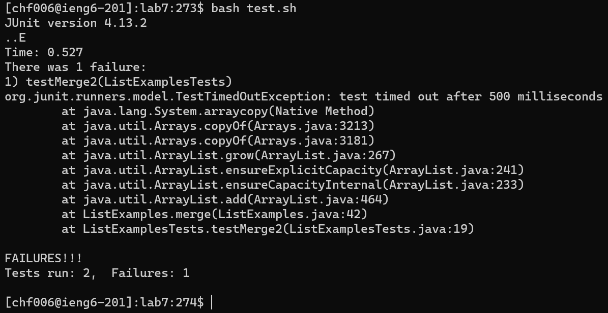
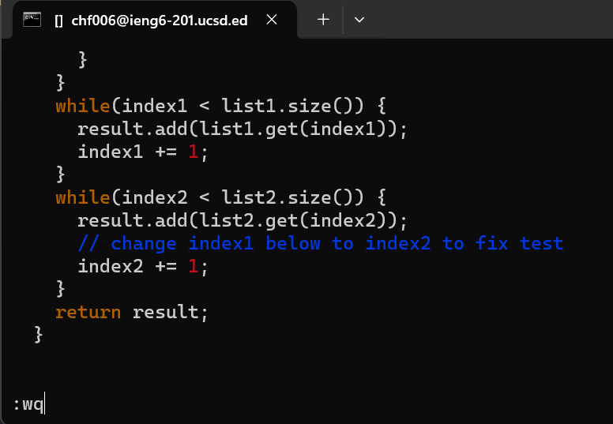
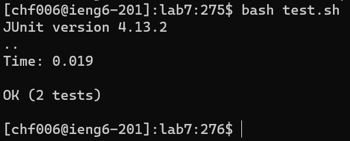
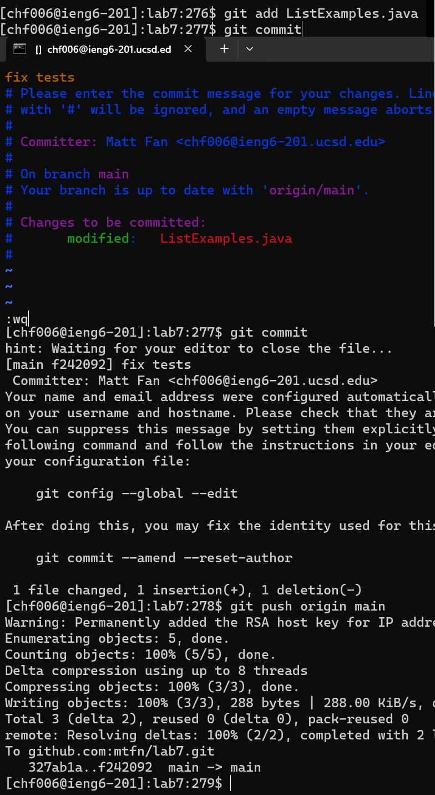

# Week 7 Lab Report - Matt Fan

## Log in to ieng6

In my terminal, I entered the following keys:
```
ssh chf006@ieng6.ucsd.edu<ENTER>
```
This had the effect of logging into ieng6 with the locally saved key generated in a previous lab, and enter ran the command to log in.

## Clone repository

I typed:
```
git clone git@github.com:mtfn/lab7.git<ENTER>
cd lab7<ENTER>
```
This clones the repository with SSH (using a special URL format) and then changes the working directory into the cloned repository.

## Run tests

```
bash test.sh<ENTER>
```
There is a script located in the repository that compiles and runs the tests. This command uses Bash to invoke it, and I can see that one of them is failing.

## Open and edit file

```
vim ListExamples.java<ENTER>
```
This opens the file with Vim. Editing the file, I typed:
```
/change<ENTER>jf1a<BACKSPACE>2
```
Entering edit mode, the slash enters Vim's find mode for the string `change`. j hops to the line below that, and f followed by `1` hops to the first occurence of `1`. a entered insert mode after the `1`. In insert mode, backspace deleted the `1`, and pressing 2 typed a `2` in its place.
```
<ESC>:wq<ENTER>
```
This exited insert mode for normal mode so that commands can be used, and then the `:wq` command closed Vim after pressing enter to execute it.
## Run tests

```
<UP><UP><ENTER>
```
This brings up the command to run the tests (`bash test.sh`), which is 2 behind in the terminal history, and enter runs it. It can be observed that all the tests pass.

## Commit and push

```
git add ListExamples.java<ENTER>
```
This command adds `ListExamples.java` to the next commit, and enter adds it.
```
git commit<ENTER>
```
This prepares the commit, but opens Vim to prompt for a commit message.
```
ifix tests<ESC>:wq<ENTER>
```
i enters insert mode, and everything remaining (`fix test`) is written onto the first line of the commit file. The `<ESC>:wq` keys again enter normal mode and save the file after enter is pressed.
```
git push origin main<ENTER>
```
The git push command finally pushes the new commit to the forked repository, on enter.
